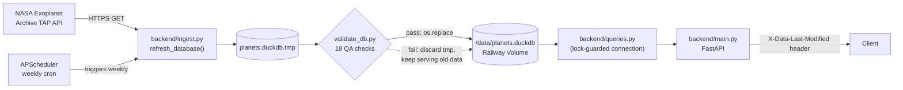

# stellar-shift

[](https://github.com/kaylynn-johnson/stellar-shift/actions/workflows/tests.yml)

A FastAPI backend that searches ~6,000 confirmed exoplanets by size, orbit, and host star, sourced from the [NASA Exoplanet Archive](https://exoplanetarchive.ipac.caltech.edu/) and computed against the [Kopparapu et al. 2013](https://complexityexplorer.s3.amazonaws.com/supplemental_materials/6.3+Exoplanets/Kopparapu_2013_ApJ_765_131.pdf) habitable-zone model. Deployed on [Railway](https://railway.com/) as a single Docker container.

**Live API:** [stellar-shift-api.up.railway.app](https://stellar-shift-api.up.railway.app/) · **Interactive docs:** [stellar-shift-api.up.railway.app/docs](https://stellar-shift-api.up.railway.app/docs#/)

## Architecture



One Railway service runs the whole thing: the FastAPI app and its weekly refresh scheduler live in the same process, sharing one Railway Volume for the DuckDB file (Railway volumes can't be attached to more than one service, which is why the refresh isn't a separate service).

### Design decisions

- **Atomic swap, not in-place writes.** Each refresh writes to `planets.duckdb.tmp`, runs the QA suite in `validate_db.py`, and only `os.replace()`s the live file if every check passes. A bad or partial refresh can never corrupt what's being served — the API just keeps answering from last week's known-good data and logs the failure.
- **Self-bootstrapping volume.** A fresh Railway Volume is empty on first deploy. Startup checks for the DB file and runs a synchronous ingest before serving traffic if it's missing, instead of crashing on import.
- **Lock-guarded connection swap, not per-request reconnects.** `queries.py` keeps one long-lived read-only DuckDB connection for the fast path, and only reopens it — under a `threading.Lock` — right after a successful refresh. Normal requests pay no reconnect cost; the swap itself is a few milliseconds, once a week.

## API

| Method | Path | Description |
|---|---|---|
| GET | `/api/planets` | All planets (name, host, orbit, radius, mass, habitable-zone flag) |
| GET | `/api/planets/search` | Filter by radius, orbital period, discovery method, spectral type; paginated |
| GET | `/api/planets/{id}` | Single planet by row id |
| GET | `/api/habitable-zone` | Habitable-zone flag and bounds for every planet |
| GET | `/health` | Liveness + last data refresh timestamp (used by Railway's health check) |

Every response includes an `X-Data-Last-Modified` header — the UTC timestamp of the last successful weekly refresh, independent of when the request was made.

```
curl -i https://<railway-url>/api/planets/search?radius_max=2&spectral_type=G
```

## Local development

```
python -m venv .venv && source .venv/bin/activate
pip install -r requirements.txt
uvicorn backend.main:app --reload
```

On first run with no `data/planets.duckdb` present, the app pulls fresh data from the NASA TAP API before it starts serving — this can take ~20-30 seconds.

To force a manual refresh: `python -m backend.ingest`

## Testing

```
pip install -r requirements-dev.txt
pytest
```

26 tests covering the API routes, the query layer, and the ingest/validation pipeline — all offline, no network calls or real database required. Tests build a small synthetic dataset through the real `clean_df`/`write_duckdb` code paths rather than hand-rolled fixtures, and only mock the true external dependency (the NASA TAP HTTP call). Notably includes a regression test (`test_refresh_connection_reads_replaced_file_not_stale_cache`) for a real bug caught during manual deployment testing: DuckDB shares one in-memory database instance per file path per process, so reopening a connection *before* closing the old one silently served stale data after a refresh instead of the newly-swapped file.

Runs on every push/PR that touches the backend (`.github/workflows/tests.yml`) — same `pip install` + `pytest` as above, on Python 3.12 to match the Dockerfile.

## Deployment (Railway)

- Builds from the root `Dockerfile`; see `railway.toml` for build/healthcheck config.
- One Railway Volume mounted at `/data`.
- Environment variables:
  - `DB_PATH=/data/planets.duckdb`
  - `CORS_ORIGINS=<comma-separated allowed origins>`
  - `REFRESH_CRON` (optional) — 5-field crontab string, defaults to `0 6 * * 1` (Monday 06:00 UTC)

## Frontend

`frontend/` is a separate Next.js app that consumes this API (in progress, not yet deployed).
